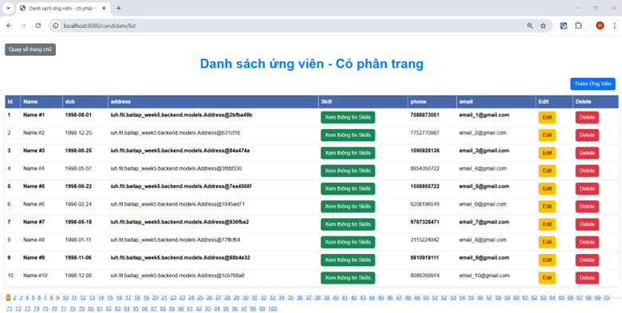
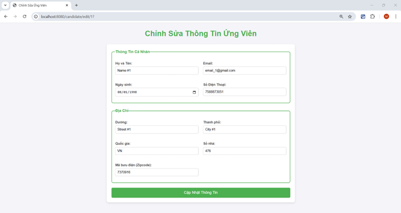

**Họ và tên: Mai Chiến Nô**

**Mssv: 21106521**

# LẬP TRÌNH WWW JAVA – BÀI TẬP WEEK 05

Note: Do em không nghe được thông báo, hôm 14 em hỏi lại thầy mới biết được là nộp link git chứ không phải file nén, nên trên git không ghi nhận lại nhiều lần commit, em xin lỗi thầy nhiều ạ...
---

# I. Mô tả ứng dụng

Ứng dụng Web của em đang được thiết kế riêng để quản lý tuyển dụng ứng viên cũng như tìm việc làm cho riêng 1 công ty (đó là FSOFT), chứ không phải là diễn đàn hay trang tuyển dụng việc làm chung cho các công ty. Nếu có điều kiện phát triển trong tương lai, ứng dụng sẽ là trang tuyển dụng việc làm chung, ở đó có danh sách các công ty, người dùng có thể truy cập vào từng công ty để tra cứu, cũng giống như truy cập vào ứng dụng web đang hiện hành này của em.
Trang web của em cho phép công ty đăng tin tuyển dụng, quản lý các công việc tuyển dụng, quản lý danh sách các ứng viên và tìm kiếm các ứng viên phù hợp cho công ty.
II. Cấu trúc Source code
Project được chia làm các phần Backend và Frontend:
- Backend:
  
 

- Frontend:
  
  
---

# II. Các màn hình và chức năng
**1.	Trang chủ (Home)**

  
- Đây là màn hình chính của ứng dụng. Bên trái là thanh menu các chức năng chính của web, bên phải là danh sách các công việc của công ty đang có như cầu tuyển ứng viên và nút đăng bài tuyển dụng.
---

**2.	Chức năng: Đăng bài tuyển dụng**

**Note:** Ở đây em tách biệt giữa tạo job và skill cho job đó, tức là tạo job xong rồi mới tạo skill của nó, giúp dễ quản lý hơn.
- Khi click chuột vào nút “Đăng bài tuyển dụng”, form “Post job” sẽ được hiển thị như sau:
  
- Nhập đầy đủ thông tin và nhấn nút “Post job”, dữ liệu về job mới đăng sẽ được hiển thị ở trang chủ (nơi chứa danh sách công việc cần ứng tuyển):
  
  
- Thêm kĩ năng cho công việc mới, bằng cách click chuột vào nút  “Xem thông tin skill” của công việc đó:
  
  
- Sau khi click chuột vào nút “Add-update Skill” thì danh sách kĩ năng của công việc đó sẽ được cập nhật như sau:
  
  
- Chúng ta có thể xóa kĩ năng đó nếu muốn hoặc cập nhật kĩ năng đó bằng cách chọn vào tên kĩ năng đó ở  form bên dưới rồi chỉnh sửa lại “skill Level” và “More Info” rồi ấn nút  “Add – update skill” là được
---

**3. Chức năng: Quản lý danh sách ứng viên**
- Có 2 trang danh sách ứng viên, 1 trang không có phân trang, trang còn lại phân theo từng trang với mỗi trang chứa 10 ứng viên:
  
 
 + Danh sách ứng viên có phân trang
 
 
- Trong trang này, chúng ta có thể xem thông tin các ứng viên, thêm, xóa hoặc chỉnh sửa ứng viên:
+ Thêm ứng viên: Click vào nút “Thêm ứng viên” trong giao diện, form thêm ứng viên mới sẽ được hiển thị:
  
 

 + Ứng viên mới được cập nhật trong giao diện:
 
 
+ Chỉnh sửa ứng viên: Chọn vào nút “Edit” của ứng viên muốn sửa, form sửa sẽ hiển thị như sau:

 
+ Xóa ứng viên: Chỉ cần click nut “DELETE” của ứng viên muốn xóa
  
+ Ngoài ra có thể xem danh sách kĩ năng của mỗi ứng viên bằng cách click vào nút “Xem thông tin Skill”:
 
- Tại đây chúng ta có thể thêm, sửa, xóa kĩ năng của ứng viên như form ở trên.
---

**4. Chức năng “Login để tìm việc làm phù hợp”**

 

- Chọn vào nút “Login để tìm việc làm phù hợp”, form nhập email được hiển thị:
 
 
 
- Click nút “Login”, danh sách công việc phù hợp với ứng viên đó sẽ hiển thị:

 

--- 

**5. Chức năng “Giúp công ty tìm ứng viên phù hợp cho công việc”**
- Chọn vào nút “Xem ứng viên phù hợp” của công việc nào đó, danh sách ứng viên phù hợp sẽ được hiển thị:
  
 

- Danh sách ứng viên phù hợp được hiển thị:

 
- Gửi mail mời:

---

**6. Chức năng “Đề xuất một số Skill chưa có của ứng viên cho từng công việc để học”**
- Chọn vào nút “các skill ứng viên cần học thêm” trên thanh menu của trang chủ:

  
- Nhập email và chọn 1 công việc cần kiểm tra xem ứng viên đó còn thiếu kĩ năng gì cho công việc đó:

  
- Danh sách các skill cần học thêm được hiển thị:

  
 
 ---

**7. Phần Mở rộng: “Tìm ứng viên có Skill đặc biệt cho công ty”**

  
- Chọn nút “Tìm ứng viên có Skill đặc thù – đặc biệt”, form nhập skill sẽ được hiển thị:
  
 
- Chọn 1 skill:

 
- Danh sách ứng viên có skill đặc biệt đó được hiển thị như sau:

  
 
